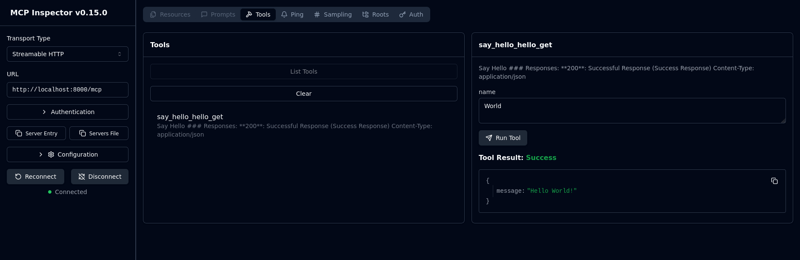

# MCP-server

## Configuration

This project uses environment variables for configuration.

1. Copy the example environment file:
   ```bash
   cp .env.example .env
   ```
2. Edit `.env` and set your Infracost API key:
   ```
   INFRACOST_API_KEY=your_actual_api_key_here
   ```

To launch the fastapi/mcp:

```
uv run main.py
```

To launch the mcp inspector:

```bash
npx @modelcontextprotocol/inspector http://localhost:8000/mcp
```



To launch the terraform readme fetcher:

```bash
uv run scripts/fetch_terraform_readmes.py
```
